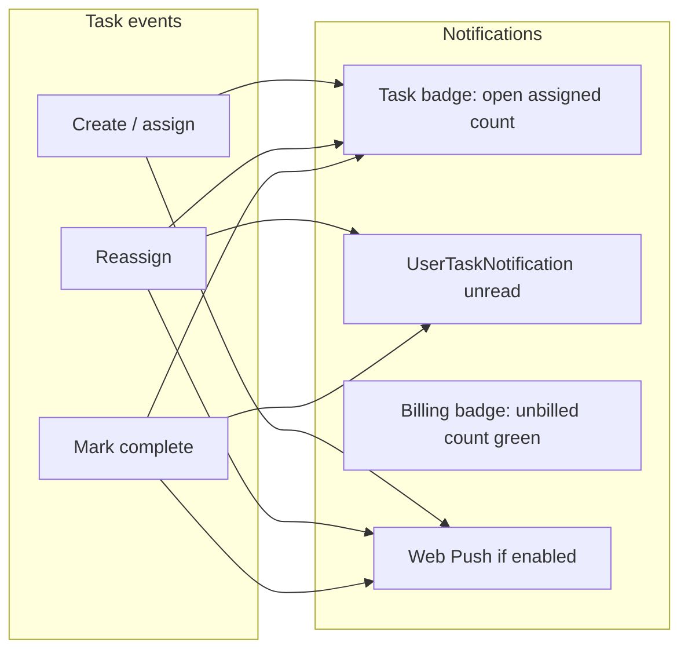

# My Tasks — Assignment, Notifications & Attachments

## Context

SkipperGPT has a **personal task system** (`UserTask` in [`backend/app/models.py`](backend/app/models.py)) separate from job checklist tasks. Today:

- [`user_id`](backend/app/models.py) is the sole owner; [`GET /api/user-tasks/mine`](backend/app/routers/user_tasks.py) lists tasks where `user_id = current user`
- No assignee, attachments, task badge, or push infrastructure (README lists push as out of scope; this feature adds it)
- Billing badge ([`frontend/app.js`](frontend/app.js) `renderUserMenuBadge`, `pollNotificationsChannel`) polls every ~5s and counts unbilled `NotificationItem` rows for admin/office only; single red pill (`#user-menu-badge`, `.topbar__user-badge`)

Per user clarification: **My tasks modal** shows two differentiated sections — **My tasks** (assigned to me) and **Tasks I've created** (created by me, even if assigned elsewhere).



---

## 1. Data model & migration

### UserTask changes

| Column | Purpose |
|--------|---------|
| `user_id` (existing) | **Creator** — unchanged column name, new documented meaning |
| `assignee_id` (new FK → `users.id`) | Current assignee; backfill `assignee_id = user_id` for all existing rows |

Add relationships: `creator`, `assignee`. Index `assignee_id`.

**Sort order & reorder (assigned list only):**

- Scope `_next_sort_order`, `move_task`, and move-up/down UI to **`assignee_id`** — the "My tasks" (assigned) section only.
- **"Tasks I've created"** list: sort by **`created_at DESC`**. No `sort_order` manipulation, no move-up/down buttons, no drag handles.

### UserTaskAttachment (new table)

Mirror [`JobPhoto`](backend/app/models.py) / [`JobDocument`](backend/app/models.py) fields:

- `user_task_id`, `original_filename`, `stored_path`, `content_type`, `size_bytes`, `uploaded_at`, `uploaded_by_user_id`
- `attachment_kind`: `"image"` | `"pdf"` (or infer from content type)

**Storage:** `{docs_root}/UserTaskAttachments/{task_id}/{uuid}.{ext}` via new `user_task_attachments_fs.py` (same atomic `.part` write pattern as [`job_photos_fs.py`](backend/app/services/job_photos_fs.py)).

### UserTaskNotification — separate table (not extending NotificationItem)

**Evaluation:** [`NotificationItem`](backend/app/models.py) is too tightly coupled to billing to extend cleanly:

| Coupling | Detail |
|----------|--------|
| Semantics | `billed` / `billed_at` / `billed_by_user_id` are billing-workflow fields; task events need `read` / dismiss |
| API | [`notifications.py`](backend/app/routers/notifications.py) — admin/office only; no per-user recipient |
| Repo | [`list_notifications`](backend/app/repositories/notifications_repo.py) returns all rows, no recipient filter |
| Frontend | [`setNotificationsState`](frontend/app.js) counts `!item.billed`; modal renders "Mark billed" / "Mark unbilled" exclusively |
| Creation | Only [`jobs.py`](backend/app/routers/jobs.py) creates rows, always `NOTIFICATION_TYPE_BILLING` with `job_id` + `task_key` |
| Display | [`renderNotificationItem`](frontend/app.js) assumes billing milestone context |

Extending with nullable `recipient_user_id` / `read` would force every billing query and UI path to filter `type = 'billing' AND recipient_user_id IS NULL`, creating ambiguity and regression risk.

**Decision:** New `user_task_notifications` table:

| Column | Purpose |
|--------|---------|
| `id` | PK |
| `recipient_user_id` | FK → users (creator) |
| `user_task_id` | FK → user_tasks |
| `event` | `"completed"` \| `"reassigned"` |
| `title`, `message` | Display copy |
| `read` | Boolean, default false |
| `created_at` | Timestamp |

New repo: `user_task_notifications_repo.py`. Billing `NotificationItem` remains untouched.

### Push infrastructure (greenfield)

| Piece | Location |
|-------|----------|
| `push_subscriptions` table | `endpoint` (unique), `p256dh`, `auth`, `user_id`, `created_at` |
| `User.push_enabled` | Boolean, default false |
| VAPID keys | `VAPID_PUBLIC_KEY`, `VAPID_PRIVATE_KEY`, `VAPID_CONTACT_EMAIL` in [`.env.example`](.env.example) / [`config.py`](backend/app/config.py) |
| Dependency | `pywebpush` in [`requirements.txt`](backend/requirements.txt) |
| Service worker | [`frontend/sw.js`](frontend/sw.js) — `push` event handler |
| Send helper | `backend/app/services/push_service.py` — `send_push_to_user(user_id, title, body, url)` |

**Startup migrations** in [`main.py`](backend/app/main.py): follow existing `_ensure_*_column()` pattern for all new columns/tables.

---

## 2. Backend API

### Assignable users list

- `GET /api/users/assignable` → `[{ id, username }]` for active users only
- Add to [`users.py`](backend/app/routers/users.py) with `get_current_user` (not admin-only)

### User tasks router ([`user_tasks.py`](backend/app/routers/user_tasks.py))

**List endpoints:**

| Endpoint | Filter | Sort |
|----------|--------|------|
| `GET /mine` | `assignee_id = current` | `sort_order ASC` |
| `GET /created` | `user_id = current` | `created_at DESC` |
| `GET /` (admin) | optional `?assignee_id=` or `?user_id=` (creator) | same as above |

**Create:** extend [`UserTaskCreate`](backend/app/schemas.py) with optional `assignee_id` (default: current user). Validate assignee exists and is active.

**Update:** extend [`UserTaskUpdate`](backend/app/schemas.py) with optional `assignee_id`. On change:
- Notify **new assignee** via push (if enabled); offer opt-in prompt on client if first assignment (see §3)
- Create `UserTaskNotification` + push for **creator** (if creator ≠ new assignee)
- Do **not** notify old assignee (badge count drops automatically)

**Complete toggle:** when `completed` flips to `true`, notify creator (push + `UserTaskNotification`) unless creator is assignee.

**Move:** `PATCH /{task_id}/move` — only valid for tasks in the assignee's list (reorders within `assignee_id` scope). No move endpoint usage from created list.

**Access control:**

```python
def _can_access_task(user, task):
    return user.role == "admin" or user.id in {task.user_id, task.assignee_id}
```

### Consolidated badge counts — single poll endpoint

**Do not** run separate polling intervals for billing vs task badges. **Do not** add a second poller channel with its own schedule.

Replace badge-driving logic with **one endpoint** called from **one channel** inside the existing `runPollCycle` (~5s interval):

```
GET /api/notifications/counts
```

Response (role-aware):

```json
{
  "billing_unbilled_count": 2,
  "assigned_open_count": 3,
  "creator_unread_count": 1
}
```

| Field | Who gets non-zero | Source |
|-------|-------------------|--------|
| `billing_unbilled_count` | admin/office only; 0 for other roles | `NotificationItem` where `billed = false` |
| `assigned_open_count` | all users | incomplete `UserTask` where `assignee_id = me` |
| `creator_unread_count` | all users | unread `UserTaskNotification` where `recipient_user_id = me` |

**Frontend polling change (explicit):**

1. Remove badge updates from `pollNotificationsChannel`.
2. Add `pollNotificationCountsChannel()` — sole source of badge counts; called once per `runPollCycle`.
3. Retain `pollNotificationsChannel` **only** for refreshing the billing notifications modal when it is open (fetch full list on demand when modal opens + after mark-billed actions; no longer drives the badge).
4. Remove any separate `/api/user-tasks/badge-summary` poll or `userTasksMine` badge side-effects.
5. Reuse existing `poller.channels` entry (repurpose `notifications` channel state for counts, or rename to `notificationCounts`) — **one** `inFlight` / `nextRunAt` / interval, not two.

### Creator task notifications API (new router or under user-tasks)

- `GET /api/user-task-notifications/mine` — list for current user
- `PATCH /api/user-task-notifications/{id}` with `{ read: true }` — dismiss (own rows only)
- Billing routes in [`notifications.py`](backend/app/routers/notifications.py) remain admin/office-only, unchanged

### Attachments router (new [`user_task_attachments.py`](backend/app/routers/user_task_attachments.py))

Under `/api/user-tasks/{task_id}/attachments`:

| Method | Auth | Notes |
|--------|------|-------|
| `GET` | creator, assignee, admin | List attachments |
| `POST` | creator or assignee | Multipart; image/PDF validation from job routers; `settings.max_upload_mb` |
| `DELETE /{id}` | creator or assignee | Remove DB row + file |
| `GET /{id}/file` | creator, assignee, admin | Download/view |

### Push subscription API (new [`push.py`](backend/app/routers/push.py))

| Method | Purpose |
|--------|---------|
| `GET /api/push/vapid-public-key` | Public key for `pushManager.subscribe` |
| `POST /api/push/subscribe` | Store subscription JSON |
| `DELETE /api/push/subscribe` | Remove subscription |
| `PATCH /api/users/me/push-enabled` | Toggle `push_enabled` |

---

## 3. Frontend ([`app.js`](frontend/app.js), [`index.html`](frontend/index.html), [`styles.css`](frontend/styles.css))

### My tasks modal — two sections

Restructure [`#user-tasks-modal`](frontend/index.html):

1. **My tasks** — assigned to me (`/mine`); reorder controls enabled
2. **Tasks I've created** — created by me (`/created`); sorted newest-first; **no** move-up/down or drag handles

Show assignee username on created rows; show creator username on assigned rows when different.

### Assignee picker

- Create form: `<select>` from `GET /api/users/assignable`
- Per row: assignee dropdown (creator, assignee, or admin)
- Default: self

### Split badge indicators (not a summed single number)

Replace single `#user-menu-badge` with a badge group in [`index.html`](frontend/index.html):

```html
<span id="user-menu-badges" class="topbar__user-badges">
  <span id="user-menu-badge-billing" class="topbar__user-badge topbar__user-badge--billing" hidden>0</span>
  <span id="user-menu-badge-tasks" class="topbar__user-badge" hidden>0</span>
</span>
```

Update [`renderUserMenuBadge`](frontend/app.js):

- Set each indicator independently from `state.billingUnbilledCount`, `state.taskBadgeCount` (where `taskBadgeCount = assignedOpenCount + creatorUnreadCount`, or show as split pill segments if both task sub-counts > 0)
- **Billing** (admin/office only when count > 0): green styling via `.topbar__user-badge--billing` — apply consistently for all roles that can see billing counts (admin/office); hidden for field users
- **Tasks** (all roles when count > 0): default red badge (existing `.topbar__user-badge` colors)
- Hide each pill when its count is 0; hide `#user-menu-badges` wrapper when both hidden
- Cap display at `99+` per pill

Optional split-pill layout: when both counts > 0, render a single pill with two segments (green billing segment + default task segment) so breakdown is visible at a glance without hovering.

State updates come **only** from `pollNotificationCountsChannel` (single poll).

### Push opt-in — deliberate action only

**Do not** prompt for `Notification.permission` on login or first visit.

Opt-in triggers (either one):

1. User toggles **Push notifications** in the user menu / My tasks settings — then request permission, register service worker, subscribe, POST subscription
2. **First time a task is assigned to the user** (by someone else) — show an in-app prompt ("Enable push notifications for task updates?") with Enable / Not now; only on Enable, request permission

If permission denied, handle gracefully; in-app badges still work. Never auto-prompt on session start.

### Attachments UI

Per task row (creator or assignee only):

- File input: `accept="image/*,.pdf,application/pdf"`
- Thumbnail grid / PDF filename
- Delete with `confirm('Remove "filename"?')`
- Upload spinner; refresh on success

### Admin modal

Filter by **assignee** (tasks assigned to that user), matching `/mine` semantics.

---

## 4. Event matrix (suppress when creator = assignee)

| Event | Assignee push | Task badge | Creator push + UserTaskNotification |
|-------|--------------|------------|--------------------------------------|
| Create, assign to other | yes | assignee +1 | no |
| Create, self-assign | no | assignee +1 | no |
| Reassign A → B | yes (B) | B +1, A −1 | yes |
| Mark complete | no | assignee −1 | yes (if creator ≠ assignee) |
| Mark incomplete | no | assignee +1 | no |

Push sends only when `user.push_enabled` and a valid subscription exists.

---

## 5. Backups — required in this feature (not deferred)

Attachments live on disk under `docs_root`; backup must include **both DB rows and files**.

### [`backup_bundle.py`](backend/app/backup_bundle.py)

Add parallel to Docs/Photos:

- Constant: `USER_TASK_ATTACHMENTS_ARCHIVE_DIR = "files/UserTaskAttachments/"`
- Export: `_write_tree_to_zip` for `{docs_root}/UserTaskAttachments/`
- Import: `_restore_tree` for attachment directory
- Manifest: `user_task_attachments_dir_exists`, `user_task_attachments_file_count`
- SQLite DB snapshot (`database/skipper.db`) already includes all ORM tables (`user_tasks`, `user_task_attachments`, `user_task_notifications`, `push_subscriptions`) — no separate CSV needed for local backup_bundle path

### [`deploy/restore_from_backup.py`](deploy/restore_from_backup.py)

Extend CSV import path (Postgres/SQLite restore):

- `user_tasks.csv`: add `assignee_id` column
- New: `user_task_attachments.csv`, `user_task_notifications.csv`, `push_subscriptions.csv` (if applicable)
- Restore `files/UserTaskAttachments/` tree from zip (same path as backup_bundle)
- Import order: users → user_tasks → user_task_attachments → user_task_notifications

### Tests

Add backup round-trip test: create task with attachment → export bundle → import → verify file on disk and DB row restored.

---

## 6. Tests (backend)

Extend [`backend/tests/test_user_tasks.py`](backend/tests/test_user_tasks.py):

- Assignment on create/update; `/mine` vs `/created` filtering and sort order
- Move rejected or N/A for created-list semantics; reorder only within assignee scope
- Access: assignee can complete; non-participant forbidden
- `GET /api/notifications/counts` returns correct role-aware breakdown
- `UserTaskNotification` created/suppressed correctly
- Attachment upload/delete permissions and size rejection (413)
- Push service unit test with mocked `pywebpush`
- Backup bundle includes attachment files

---

## 7. Deployment notes

- Generate VAPID keys once; add to production `.env`
- Service worker requires HTTPS (already on production)
- Attachment directory under existing `docs_root` volume

---

## Key files to touch

| Area | Files |
|------|-------|
| Models | [`models.py`](backend/app/models.py) |
| Schemas | [`schemas.py`](backend/app/schemas.py) |
| Repos | [`user_tasks_repo.py`](backend/app/repositories/user_tasks_repo.py), new `user_task_attachments_repo.py`, new `user_task_notifications_repo.py` |
| Routers | [`user_tasks.py`](backend/app/routers/user_tasks.py), new `user_task_attachments.py`, new `user_task_notifications.py`, [`users.py`](backend/app/routers/users.py), new `push.py`, new counts endpoint in notifications or dedicated router |
| Services | new `push_service.py`, `user_task_attachments_fs.py` |
| Backups | [`backup_bundle.py`](backend/app/backup_bundle.py), [`restore_from_backup.py`](deploy/restore_from_backup.py) |
| Migrations | [`main.py`](backend/app/main.py) |
| Frontend | [`app.js`](frontend/app.js), [`index.html`](frontend/index.html), [`styles.css`](frontend/styles.css), new [`sw.js`](frontend/sw.js) |
| Config | [`config.py`](backend/app/config.py), [`.env.example`](.env.example), [`requirements.txt`](backend/requirements.txt) |
