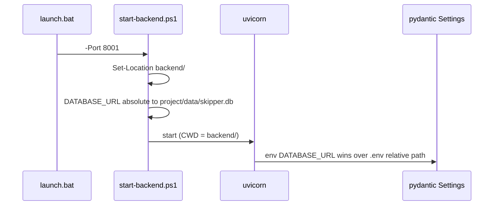

# Three fixes: dev port, DB path, 401 toast flood

## Context

| Issue | Root cause | Files |
|-------|------------|-------|
| Auth failures on dev copy | `launch.bat` and live rig both bind **8000**; Windows routes between processes | [launch.bat](launch.bat) |
| Wrong / missing SQLite DB | `Set-Location $backendRoot` makes `sqlite:///./data/skipper.db` resolve to `backend/data/skipper.db` | [backend/start-backend.ps1](backend/start-backend.ps1) |
| Toast flood | Up to 6 concurrent thumbnail `authFetch` calls each run the 401 handler | [frontend/app.js](frontend/app.js) |
| Debug log growth | Session-debug instrumentation logs every API request to `debug-554ce3.log` | [frontend/app.js](frontend/app.js), [backend/app/deps/auth.py](backend/app/deps/auth.py), [backend/app/main.py](backend/app/main.py) |

Frontend uses relative `const API = "/api"` — no hardcoded port in JS; changing `launch.bat` port is sufficient for the browser/ngrok path.



---

## Fix 1 — Dev port 8001 in `launch.bat`

Replace **8000** with **8001** in all four places in [launch.bat](launch.bat):

1. **Line 32** — `-Port` passed to `start-backend.ps1`:
   ```bat
   set "BACKEND_CMD=powershell ... -Port 8001"
   ```
2. **Line 42** — fallback browser URL when ngrok is missing
3. **Line 46** — ngrok tunnel target: `ngrok http 8001 --url=...`
4. **Line 52** — local-only browser URL

**Out of scope (per your spec):** [backend/start-backend.ps1](backend/start-backend.ps1) default `$Port = 8000`, [README.md](README.md), and `setup-backend.ps1` — the launcher always passes `-Port` explicitly, so only `launch.bat` needs changing for this dev copy.

There is no `netstat` usage in the repo today; only the URLs above need updating.

---

## Fix 2 — Absolute `DATABASE_URL` in `start-backend.ps1`

After **line 37** (`Set-Location $backendRoot`), before building `$uvicornArgs` (before uvicorn starts), insert:

```powershell
$env:DATABASE_URL = "sqlite:///" + (Join-Path (Split-Path $backendRoot -Parent) "data\skipper.db").Replace("\", "/")
```

- `Split-Path $backendRoot -Parent` → project root (`G:\SkipperGPT`)
- Forward slashes satisfy SQLite URL conventions used elsewhere
- Pydantic Settings in [backend/app/config.py](backend/app/config.py) reads `DATABASE_URL` from the environment and overrides the relative value from `.env`
- **Do not** change `Set-Location` — uvicorn still needs `backend/` as CWD for `app.main:app`

---

## Fix 3 — Guard 401 handling in `frontend/app.js`

### 3a. Module-level flag

Near the top constants (after `TOKEN_KEY`, ~line 7):

```js
let _sessionExpired = false;
```

### 3b. Shared 401 block in `api()` and `authFetch()`

Replace the current 401 blocks in both functions (~lines 1569–1576 and 1609–1616) with:

```js
if (res.status === 401) {
  if (!_sessionExpired) {
    _sessionExpired = true;
    localStorage.removeItem(TOKEN_KEY);
    state.token = null;
    toast("Session expired — please sign in again.", "error");
    setTimeout(() => location.reload(), 800);
  }
  throw new Error("Unauthorized");
}
```

Notes:
- First 401 clears token, shows one toast, schedules reload; concurrent 401s only throw
- Adds `state.token = null` (missing in current `api`/`authFetch` handlers)
- Replaces existing 401 blocks including temporary `#region agent log` debug ingest calls to `127.0.0.1:7437`
- **`stopAppPolling()`:** The session-expired path does not call `logout()` — it clears token and `location.reload()` after 800ms. That is fine: reload tears down the page and all timers. `logout()` still calls `stopAppPolling()` for deliberate sign-out. Add a brief comment above the guarded 401 block noting that reload makes `stopAppPolling()` unnecessary on this path.

Also remove leftover debug ingest in `authHeaders()` and `authFetch()` (before-request log), not only the 401 blocks.

### 3c. Reset on deliberate logout

In `logout()` (~line 1548), set `_sessionExpired = false` before clearing storage (e.g. first line of the function) so logout → re-login does not skip the next real session-expired flow.

---

## Fix 4 — Remove debug-session instrumentation

Leftover from debug session `554ce3`; writes on every request and grows `debug-554ce3.log` in the project root indefinitely.

### [frontend/app.js](frontend/app.js)

Remove all `#region agent log` blocks and `fetch('http://127.0.0.1:7437/ingest/...')` calls:
- `authHeaders()` (~line 1542)
- `authFetch()` before-request (~line 1605)
- 401 blocks in `api()` and `authFetch()` (replaced by Fix 3b guarded handler)

### [backend/app/deps/auth.py](backend/app/deps/auth.py)

- Delete `_debug_log()` entirely (lines 19–39)
- Remove all `_debug_log(...)` calls and `# region agent log` wrappers inside `get_current_user`
- Drop unused imports: `json`, `time`, `PROJECT_ROOT`

### [backend/app/main.py](backend/app/main.py)

- Delete the entire `_debug_log_unauthorized` middleware (~lines 258–310)
- Remove unused `import json` and `import time` (only used by that middleware)

Optional: delete existing `.cursor/debug-554ce3.log` / `debug-554ce3.log` if present (not required for the fix).

---

## Verification (manual)

1. **Port:** Run `launch.bat`, confirm backend listens on `127.0.0.1:8001` (browser opens `:8001/`). Live rig on 8000 should no longer steal connections.
2. **DB:** After launch, confirm API uses `data/skipper.db` at project root (e.g. existing jobs load; no empty DB at `backend/data/`).
3. **401:** With an invalid/expired token, open a job with many thumbnails — expect **one** “Session expired” toast, not a stack of six.
4. **Debug cleanup:** After a few API requests, confirm `debug-554ce3.log` is not created/append in the project root.

No `.env` changes required beyond the PowerShell env override in `start-backend.ps1`.
